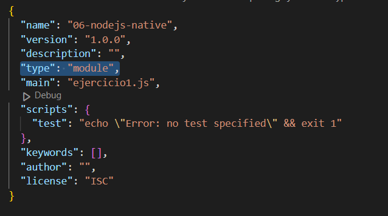

## Configurar entorno para utilizar los import en vez de los required en un archivo .js y no tener que ponerlo como .mjs

En la terminal, tenemos que tener la ruta de los archivos que usan el codigo Javascript y ejecutar el siguiente comando en la terminal:

``` 
npm init -y 
```

Se generará un archivo package.json en la ruta de los archivos con el código js y hay que modificarlo añadiendole 

``` 
"type": "module",
```

En el siguiente lugar del json




